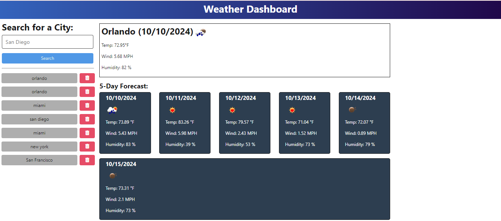

# NewWeatherAPI
This repository deploys an Weather Tracker App that can generated in the terminal.

The following programs was used to create the Weather Tracker App: JavaScript, Typescript, HTML, & CSS. 

# How to Use Weather Tracker

Run this command in the terminal:

npm run start

Your browser will open this window http://localhost:3001/

# Render Deployed Program Link

https://weathertrackerapp.onrender.com

https://newweatherapi.onrender.com